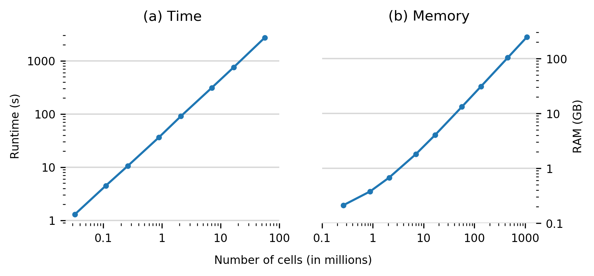

# Summary

Controlled-source electromagnetic (CSEM) surveys are a common geophysical
investigation tool in the search for, amongst other, groundwater, hydrocarbons,
and minerals. The numerical modelling of CSEM data requires the solution of the
Maxwell equations. These can be simplified in the particular case of CSEM, as
the frequencies used in surveys are usually sufficiently low to ignore any
displacement currents. A diffusive problem remains, which resulting system of
equations is given in the frequency domain by

$$ \eta \mathbf{E} - \nabla \times \mu_\mathrm{r}^{-1} \nabla \times \mathbf{E}
= -\mathrm{i}\omega\mu_0\mathbf{J}_\mathrm{s} \, ,$$

where $\eta = \mathrm{i}\omega \mu_0(\sigma - \mathrm{i}\omega\varepsilon)$.
The electric field and the current source are denoted as $\mathbf{E}$ and
$\mathbf{J}_\mathrm{s}$, respectively, $\sigma$ is conductivity, $\omega$ is
angular frequency, $\varepsilon=\varepsilon_0\varepsilon_\mathrm{r}$ the
electric permittivity, and $\mu=\mu_0\mu_\mathrm{r}$ the magnetic permeability.

Various open-source codes exist to model CSEM responses for a layered Earth,
e.g., *DIPOLE1D* [@DIPOLE1D] and *empymod* [@empymod], and for a
two-dimensional Earth, e.g., *MARE2DEM* [@MARE2DEM]. Open-source modellers for
a three-dimensional (3D) Earth only recently became available, notably *SimPEG*
[@SimPEG], *PETGEM* [@PETGEM], and *custEM* [@custEM]. SimPEG is a framework
that not only includes CSEM but also other geophysical methods and can model
them on various types of regular grids. It currently uses mostly the direct
solver *PARDISO* [@PARDISO]. PETGEM and custEM use finite elements with the
*FEniCS* [@FEniCS] solver. All three codes require substantial memory and are
not easily run on a laptop for models with several million cells.

@Mulder:2006 has shown that the multigrid method [@Briggs:2000], which reduces
memory requirement substantially, works fine for diffusive CSEM problems. This
was later also confirmed by others [@Jaysaval:2016]. However, the multigrid
CSEM codes of these publications are proprietary. The code *emg3d* is a
multigrid solver for 3D CSEM diffusion with tri-axial electrical anisotropy
using a staggered grid [@Mulder:2006;@Mulder:2007]. It can act as a solver on
its own, or be used as a preconditioner for various Krylov subspace methods.
Multigrid solvers can struggle to converge with strong grid-stretching or
strong anisotropy. We implemented *semicoarsening* (coarsening the grid only in
some coordinate directions) and *line relaxation* (solving for the values of a
whole gridline simultaneously in some directions) inside the multigrid
technique to deal with these issues [@Jonsthovel:2006].

The code is written completely in Python using the NumPy/SciPy stack
[@NumPy;@SciPy], where the most time- and memory-consuming parts are sped up
through jitted functions using Numba [@Numba]. It can currently be used as a
stand-alone modeller or as a solver in conjunction with the SimPEG-framework.

# Acknowledgements

This code was developed within the Gitaro.JIM project funded through MarTERA as
part of Horizon 2020, a funding scheme of the European Research Area (ERA-NET
Cofund, https://www.martera.eu).

# References
